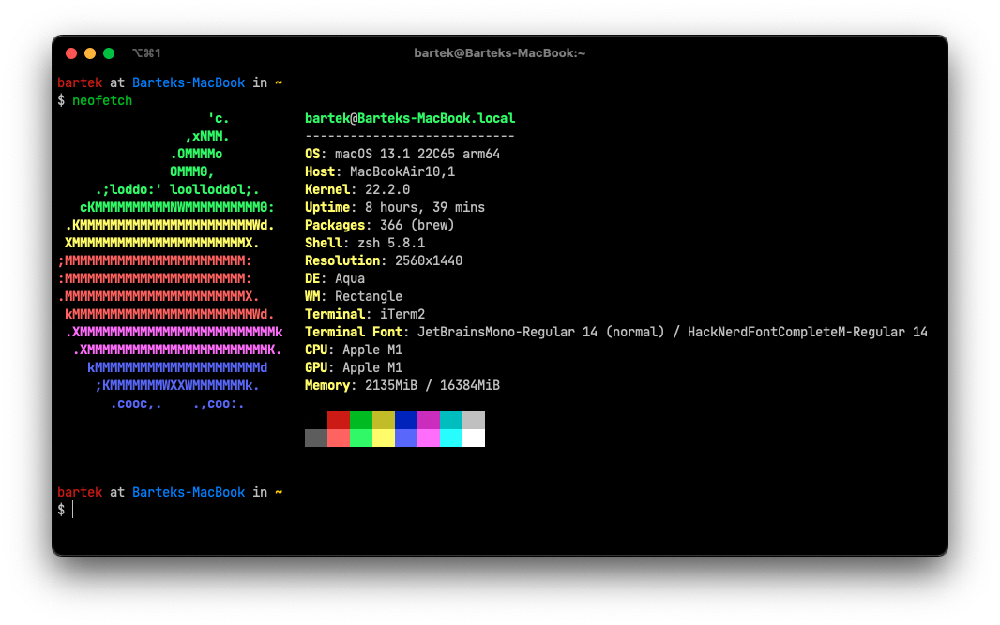

# dotfiles

My very personal development environment setup. I refuse to work without it.



## Set up on macOS

On macOS, simply use [strap](https://github.com/MikeMcQuaid/strap).

## Set up on UNIX

On other Unix-like systems, `git clone` this repository to the `$HOME/.dotfiles`
directory.

**SSH**

```console
git clone git@github.com:bartekpacia/dotfiles.git ~/.dotfiles
```

**HTTPS**

```console
git clone https://github.com/bartekpacia/dotfiles.git ~/.dotfiles
```

Once cloned, execute `script/setup`:

```console
~/.dotfiles/script/setup
```

> `script/setup` depends on `curl`, `git`, `zsh`.

## Set up SSH keys

After setting up a new machine, you very likely want to set up SSH
authentication to it.

Get public key from password manager:

```console
op read "op://Personal/main key/public key" > ~/.ssh/main_key.pub
chmod 0400 ~/.ssh/main_key.pub
```

Copy public key to remote machine:

```console
ssh-copy-id -f -i ~/.ssh/main_key.pub $REMOTE_USER@$REMOTE_HOST
```

or use [my `get_ssh_key` script][get_ssh_key]:

```console
get_ssh_key 'Personal' 'main key'
```

## File descriptions

- `ssh/config` SSH config.

- `script/setup_dock` Sets up my Dock the way I want.

- `script/disable_chime` Disables the dumb macOS's startup chime.

- `files/com.googlecode.iterm2.plist` iTerm2 global settings.

- `files/bartek.itermkeymap` iTerm2 global keybindings.

- `files/settings.json` Windows Terminal global settings.

- `local` All scripts in this folder are gitignored and automatically sourced by
  zshrc.

  Example use case:

  - startup shell scripts from JetBrains Toolbox app

[get_ssh_key]: https://github.com/bartekpacia/scripts/blob/master/bin/get_ssh_key
